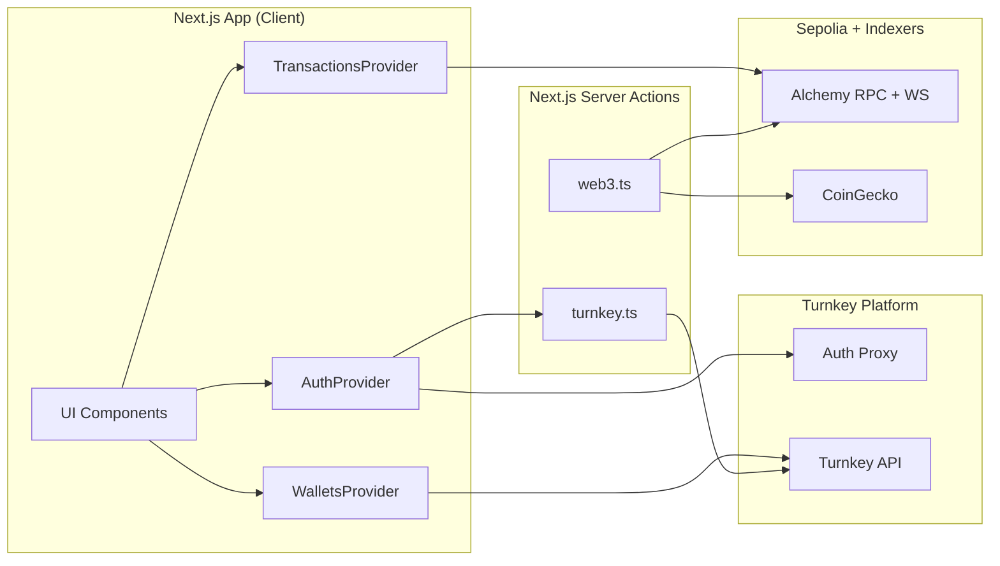
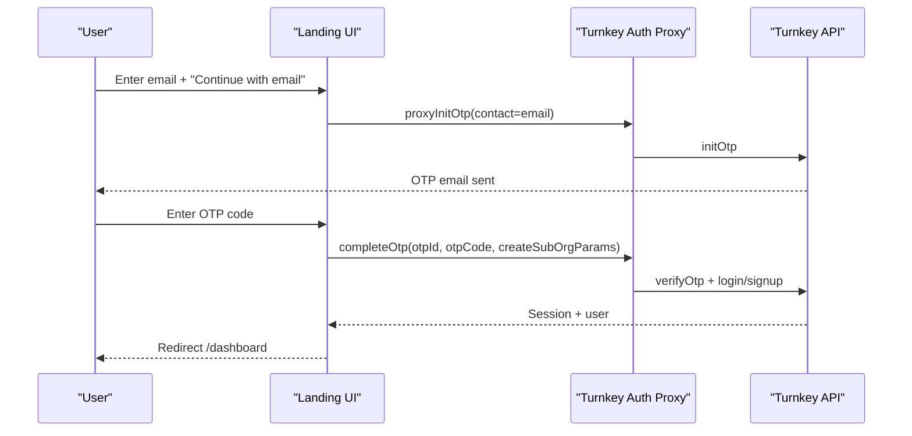
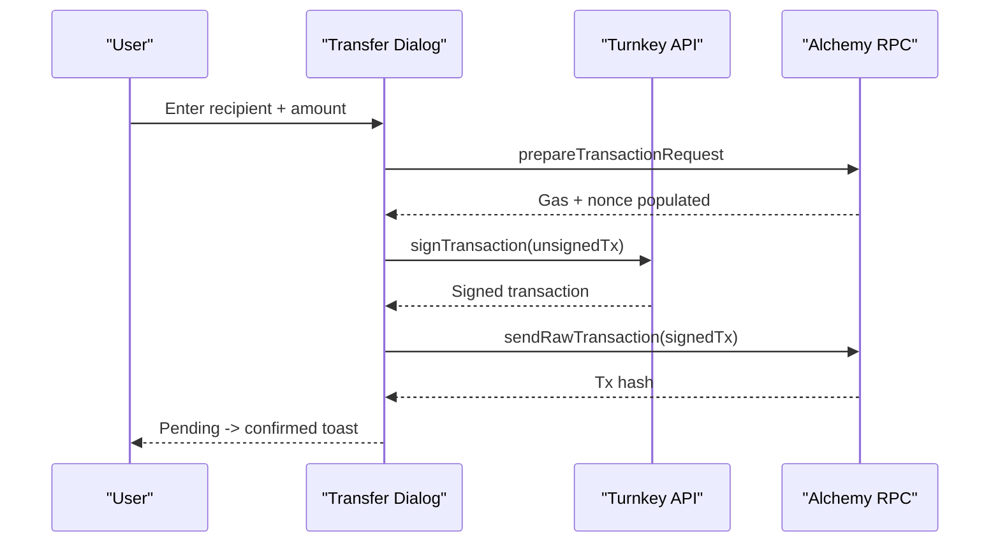

# NGP Wallet Integration

Enterprise embedded wallet platform powered by Turnkey infrastructure, built with Next.js and Ethereum Sepolia.

## Table of Contents

- [Quickstart](#quickstart)
- [Configuration](#configuration)
- [Architecture Overview](#architecture-overview)
- [Key Flows (Sequence Diagrams)](#key-flows-sequence-diagrams)
- [Feature Tour (What the App Does)](#feature-tour-what-the-app-does)
- [Turnkey Integration Details](#turnkey-integration-details)
- [Turnkey Troubleshooting](#turnkey-troubleshooting)
- [Email OTP Flows (Context)](#email-otp-flows-context)
- [Target Network](#target-network)
- [Docker Deployment](#docker-deployment)
- [Testing](#testing)
- [CI/CD](#cicd)
- [Agent System](#agent-system)
- [Project Structure](#project-structure)
- [Scripts](#scripts)

## Quickstart

1. Install dependencies

```bash
pnpm install
```

2. Create `.env.local`

```bash
cp .env.example .env.local
```

3. Fill environment variables (see "Configuration" below).
4. Run the app

```bash
pnpm dev
```

## Configuration

All environment variables are validated at startup via `@t3-oss/env-nextjs`
in `src/env.mjs`. Required variables live in `.env.example`. Set
`SKIP_ENV_VALIDATION=1` to bypass validation for local builds without
credentials (`pnpm build:local`).

### Turnkey (required)

| Variable | Description |
|---|---|
| `NEXT_PUBLIC_ORGANIZATION_ID` | Your Turnkey parent organization ID |
| `NEXT_PUBLIC_BASE_URL` | Turnkey API base URL (default `https://api.turnkey.com`) |
| `NEXT_PUBLIC_AUTH_PROXY_ID` | Auth Proxy config ID for OTP and passkey flows |
| `NEXT_PUBLIC_APP_URL` | App URL used for OAuth redirect URIs (e.g. `http://localhost:3000`) |
| `TURNKEY_API_PUBLIC_KEY` | Server-side Turnkey API public key |
| `TURNKEY_API_PRIVATE_KEY` | Server-side Turnkey API private key |

### OAuth (required)

| Variable | Description |
|---|---|
| `NEXT_PUBLIC_GOOGLE_OAUTH_CLIENT_ID` | Google OAuth client ID |
| `NEXT_PUBLIC_APPLE_OAUTH_CLIENT_ID` | Apple OAuth client ID |
| `NEXT_PUBLIC_FACEBOOK_CLIENT_ID` | Facebook app ID |
| `NEXT_PUBLIC_FACEBOOK_AUTH_VERSION` | Facebook SDK version (e.g. `11.0`) |
| `NEXT_PUBLIC_FACEBOOK_GRAPH_API_VERSION` | Facebook Graph API version (e.g. `21.0`) |
| `FACEBOOK_SECRET_SALT` | Random alphanumeric string for Facebook OIDC nonce |

### Sepolia funding (warchest)

| Variable | Description |
|---|---|
| `TURNKEY_WARCHEST_ORGANIZATION_ID` | Warchest org ID (separate from main org) |
| `TURNKEY_WARCHEST_API_PUBLIC_KEY` | Warchest API public key |
| `TURNKEY_WARCHEST_API_PRIVATE_KEY` | Warchest API private key |
| `WARCHEST_PRIVATE_KEY_ID` | Private key ID used to sign funding transactions |

### Web3 + pricing (required)

| Variable | Description |
|---|---|
| `NEXT_PUBLIC_ALCHEMY_API_KEY` | Alchemy API key for Sepolia RPC, websockets, and asset transfers |
| `COINGECKO_API_KEY` | CoinGecko demo API key for ETH/USD price |

### Optional

| Variable | Description |
|---|---|
| `NEXT_PUBLIC_AUTH_PROXY_URL` | Auth Proxy endpoint (wallet kit uses default if unset) |
| `NEXT_PUBLIC_RP_ID` | WebAuthn relying party ID for passkeys (auto-detected from app URL in dev) |
| `NEXT_PUBLIC_AUTH_IFRAME_URL` | Custom Turnkey auth iframe URL |
| `NEXT_PUBLIC_EXPORT_IFRAME_URL` | Custom Turnkey export iframe URL |
| `NEXT_PUBLIC_IMPORT_IFRAME_URL` | Custom Turnkey import iframe URL |
| `CURSOR_API_KEY` | Cursor API key for programmatic agent invocation |

## Architecture Overview



### Provider Hierarchy

Root layout (`src/providers/index.tsx`):

```
ThemeProvider (next-themes, forced light)
  > TurnkeyProvider (@turnkey/react-wallet-kit)
    > AuthProvider (custom context -- auth state + login/logout methods)
```

Dashboard layout (`src/app/(dashboard)/layout.tsx`) adds:

```
AuthGuard
  > WalletsProvider (wallet/account selection, creation, balance caching)
    > NavMenu + page content
```

## Key Flows (Sequence Diagrams)

See [AGENTS.md](AGENTS.md) for the multi-agent system documentation and flow diagrams for the AI agent orchestration layer.

### Auth: Email OTP (Auth Proxy)



### Auth: OAuth (Google / Apple / Facebook)

Google and Apple are handled entirely by `@turnkey/react-wallet-kit`. Facebook uses a PKCE flow with a custom callback at `/oauth-callback/facebook`.

### Signing & Sending ETH



## Feature Tour (What the App Does)

- **Auth**: Passkey, Email OTP (proxy), OAuth (Google, Apple, Facebook), External wallet (MetaMask)
- **Wallets**: Multi-wallet/account support, create, import, export
- **Faucet**: One-time 0.001 ETH funding via warchest
- **Transfers**: Send ETH with gas estimation, real-time activity via Alchemy websocket
- **Session Management**: 15-minute expiry with warning modal, auto-refresh

## Turnkey Integration Details

See `src/config/turnkey.ts` for the full `TurnkeyProviderConfig`.

| Package | Usage |
|---|---|
| `@turnkey/react-wallet-kit` | TurnkeyProvider, auth flows, wallet CRUD, signing, import/export |
| `@turnkey/sdk-react` | `useTurnkey()` for passkeyClient, indexedDbClient, walletClient |
| `@turnkey/sdk-server` | TurnkeyServerClient, ApiKeyStamper, DEFAULT_ETHEREUM_ACCOUNTS |
| `@turnkey/viem` | createAccount to bridge Turnkey signing into a viem Account |

## Turnkey Troubleshooting

- **Auth Proxy misconfig**: Check `NEXT_PUBLIC_AUTH_PROXY_ID` and `NEXT_PUBLIC_AUTH_PROXY_URL`
- **OAuth redirect mismatch**: Verify provider redirect URI matches `NEXT_PUBLIC_APP_URL`
- **Passkey failures**: Ensure `NEXT_PUBLIC_RP_ID` matches deployment domain, use HTTPS in production
- **Server action 401/403**: Validate `TURNKEY_API_PUBLIC_KEY`, `TURNKEY_API_PRIVATE_KEY`, `NEXT_PUBLIC_ORGANIZATION_ID`
- **Faucet not funding**: Ensure warchest org is funded and all `TURNKEY_WARCHEST_*` vars are set
- **Alchemy/price errors**: Confirm `NEXT_PUBLIC_ALCHEMY_API_KEY` and `COINGECKO_API_KEY` are valid

## Email OTP Flows (Context)

Two email OTP approaches exist but only the proxy flow is actively used:
- **Proxy OTP** (active): `src/components/auth.tsx`, `src/app/(landing)/verify-email/page.tsx`
- **Magic link** (reference): `src/providers/auth-provider.tsx`, `src/app/(landing)/email-auth/page.tsx`

## Target Network

This project targets **Ethereum Sepolia** only. To swap networks, update `src/lib/web3.ts`, `src/actions/web3.ts`, `src/config/turnkey.ts`, and UI copy.

## Docker Deployment

```bash
# Build and run
docker compose up --build

# Or build manually
docker build -t ngp-wallet-int .
docker run -p 3000:3000 --env-file .env.local ngp-wallet-int
```

The Dockerfile uses a multi-stage build with Next.js standalone output. Health check at `/api/health`.

## Testing

```bash
pnpm test              # Run tests once
pnpm test:watch        # Watch mode
pnpm test:coverage     # With coverage report
```

Uses Vitest with React Testing Library and jsdom.

## CI/CD

GitHub Actions pipelines in `.github/workflows/`:
- **ci.yml**: Lint, typecheck, test, Docker build validation on push/PR to main
- **deploy.yml**: Build and push Docker image to GHCR on main push

## Agent System

See [AGENTS.md](AGENTS.md) for full documentation of the multi-agent system including the Orchestrator, Enterprise Solutions Architect, Monetization Strategist, and Business Intelligence agents.

## Scripts

| Command | Description |
|---|---|
| `pnpm dev` | Start Next.js development server |
| `pnpm build` | Production build (validates env vars) |
| `pnpm build:local` | Production build with `SKIP_ENV_VALIDATION=1` |
| `pnpm start` | Start production server |
| `pnpm lint` | Run ESLint |
| `pnpm format` | Format code with Prettier |
| `pnpm format:check` | Check formatting without writing |
| `pnpm test` | Run test suite |
| `pnpm test:watch` | Run tests in watch mode |
| `pnpm test:coverage` | Run tests with coverage |
| `pnpm agent:orchestrate` | Run orchestrator agent via Cursor SDK |
| `pnpm agent:run` | Run a single agent skill via Cursor SDK |
